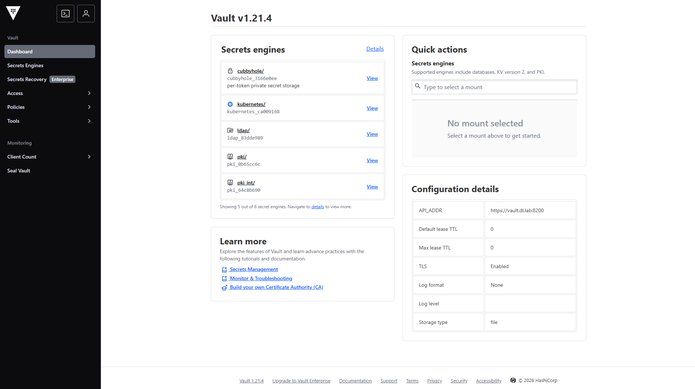
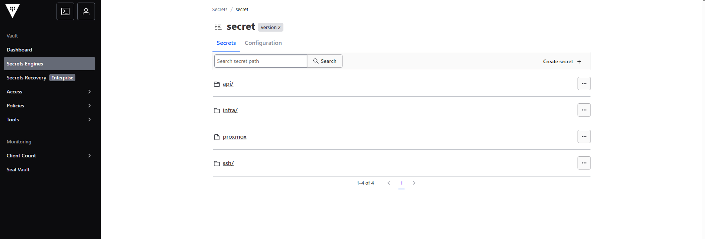
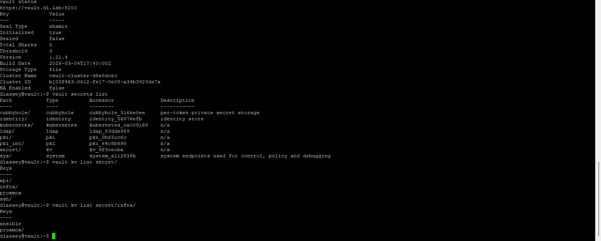

<div align="center">

#  HashiCorp Vault — Secrets Management (KV v2)


---
> **DL Labs |  SEC-001**
> Part of the [DL Labs](https://github.com/dlassey-labs) self-hosted infrastructure programme.
---
</div>


## Overview

This project documents the deployment and configuration of **HashiCorp Vault** as a centralized secrets management solution in the DL Labs platform.

Scope of this document: **KV v2 secrets engine only.**
PKI, Root CA, Intermediate CA, and TLS certificate issuance are documented separately (SEC-002).

**Key outcomes:**

- Vault deployed with TLS enabled on an internal DNS hostname
- KV v2 engine enabled for structured secret storage
- Dedicated policies and tokens per consuming identity
- Secrets taxonomy defined for infrastructure, API keys, SSH credentials, and applications
- Root token never used for automation — principle of least privilege enforced

---

## Environment

| Parameter | Value |
|-----------|-------|
| Vault version | v1.21.4 (OSS) |
| TLS | Enabled |
| Internal DNS | `vault.dl.lab` (replace with your internal domain) |
| KV engine path | `secret/` |
| Storage backend | File (single-node lab) |
| Seal type | Shamir (5 shares, threshold 3) |

---

## Installation

Vault is installed from the official HashiCorp APT repository.

```bash
sudo apt update
sudo apt install -y gpg wget

wget -O- https://apt.releases.hashicorp.com/gpg \
  | sudo gpg --dearmor \
  -o /usr/share/keyrings/hashicorp-archive-keyring.gpg

echo "deb [signed-by=/usr/share/keyrings/hashicorp-archive-keyring.gpg] \
https://apt.releases.hashicorp.com $(lsb_release -cs) main" \
  | sudo tee /etc/apt/sources.list.d/hashicorp.list

sudo apt update && sudo apt install vault -y
vault version
```

---

## TLS Configuration

Vault is configured to use TLS. Certificates are issued by the internal Vault PKI (SEC-002) or pre-provisioned manually for bootstrap.

See `vault.hcl.example` in this repository for a ready-to-use configuration template.

`/etc/vault.d/vault.hcl`:

```hcl
ui = true

storage "file" {
  path = "/opt/vault/data"
}

listener "tcp" {
  address     = "0.0.0.0:8200"
  tls_disable = 0

  tls_cert_file = "/opt/vault/tls/vault.crt"
  tls_key_file  = "/opt/vault/tls/vault.key"
}

api_addr     = "https://vault.dl.lab:8200"
cluster_addr = "https://vault.dl.lab:8201"
```

> Replace `vault.dl.lab` with your internal DNS domain.

---

## Initialization & Unsealing

```bash
export VAULT_ADDR="https://vault.dl.lab:8200"

# Initialize — generates unseal keys and root token
vault operator init
```

> **Security note:** Store unseal keys and the root token in a secure offline location immediately. These are shown only once.

```bash
# Unseal (repeat 3 times with different keys)
vault operator unseal

# Verify
vault status
# Expected: Sealed = false
```

---

## Login

```bash
vault login
# Enter root token or a valid token with appropriate policies
```

---

## KV v2 Engine

```bash
# Verify existing engines
vault secrets list

# Enable KV v2
vault secrets enable -path=secret kv-v2

# Verify
vault secrets list
# Expected: secret/ kv
```

---

## Secrets Taxonomy

Secrets are organized by target system and consuming identity:

```
secret/
├── infra/
│   ├── ansible       # Proxmox API token for Ansible
│   ├── terraform     # Proxmox API token for Terraform
│   ├── proxmox       # Admin credentials
│   ├── opnsense      # Firewall credentials
│   ├── pbs           # Backup server credentials
│   └── truenas       # Storage credentials
│
├── api/
│   ├── openai
│   ├── openrouter
│   ├── tavily
│   ├── gitlab
│   └── n8n
│
├── ssh/
│   ├── proxmox
│   └── workstation
│
└── apps/
    ├── keycloak
    ├── vault
    
```

**Naming convention:** `secret/<target_system>/<consuming_identity>`

---

## Secret Operations

### Write a secret

```bash
vault kv put secret/infra/ansible \
  proxmox_token_id="<token-id>" \
  proxmox_token_secret="<token-secret>"
```

### Read a secret

```bash
vault kv get secret/infra/ansible

# Read a single field
vault kv get -field=proxmox_token_secret secret/infra/ansible
```

### Update (creates a new version automatically)

```bash
vault kv put secret/infra/ansible \
  proxmox_token_id="<token-id>" \
  proxmox_token_secret="<new-secret>"
```

### Delete

```bash
vault kv delete secret/infra/ansible
```

---

## Policies

Each consuming identity gets a dedicated policy scoped to its own path.

Example — read-only policy for Ansible (see `policies/ansible-policy.hcl.example`):

```hcl
path "secret/data/infra/ansible" {
  capabilities = ["read"]
}
```

```bash
# Load the policy
vault policy write ansible ansible-policy.hcl

# Create a dedicated token
vault token create -policy=ansible
```

---

## Integration with Terraform

Vault secrets are consumed by Terraform via the Vault provider. The token is passed through environment variables — never stored in `.tfvars` files committed to source control.

```bash
export VAULT_TOKEN="<automation-token>"
export VAULT_ADDR="https://vault.dl.lab:8200"
```

See [TF-001 — Terraform Proxmox Pipeline](https://github.com/dlassey-labs) for the full integration.

---

## Key Decisions & Lessons Learned

| Decision | Rationale |
|----------|-----------|
| TLS enabled from day one | Vault transmits credentials — plaintext is never acceptable, even on internal networks |
| Internal DNS hostname, not IP | Allows certificate CN matching; decouples Vault from its IP address |
| Root token never used for automation | Dedicated tokens with scoped policies enforce least privilege |
| KV v2 over KV v1 | Built-in versioning, soft-delete, and metadata support |
| Secrets Management separated from PKI docs | Different lifecycle and audience — PKI documented in SEC-002 |
| File backend (single node) | Sufficient for a single-node lab; Raft backend documented as migration path for HA |

---

## Deployment Evidence

> Real deployment on DL Labs infrastructure — single-node Proxmox LXC, TLS enabled, KV v2 active.

### Vault Dashboard (UI)


*Vault v1.21.4 — TLS enabled, API_ADDR: `https://vault.dl.lab:8200`, Storage: file*

### Secrets Engine & KV Structure (UI)


*KV v2 engine active — organized taxonomy: `infra/`, `api/`, `ssh/`*

### CLI Overview


*`vault status` → Sealed: false | `vault secrets list` → all engines | `vault kv list` → taxonomy*

---

## Roadmap & Planned Improvements

| ID | Improvement | Status |
|----|-------------|--------|
| SEC-003 | **Auto-unseal** — systemd-based script submitting Shamir keys sequentially on boot. Eliminates manual unseal after reboot | 🔵 Planned |
| SEC-003 | **Reverse proxy** — expose Vault via `vault.dl.lab` on standard HTTPS port 443 via NPM or Traefik, eliminating `:8200` in all URLs | 🔵 Planned |

---

## Related Projects

| ID | Project | Status |
|----|---------|--------|
| SEC-001 | HashiCorp Vault — Secrets Management | ✅ Done |
| SEC-002 | Vault PKI — Internal CA | ✅ Done |
| SEC-003 | Vault Auto-Unseal | 🔵 Planned |
| TF-001 | Terraform Proxmox Pipeline | ✅ Done |
| ANS-001 | Ansible Control Node | 🔵 Planned |

---

## Repository Structure

```
DL-LABS / SECURITY / VAULT /
├── vault/
│   ├── README.md                          # This document
│   ├── vault.hcl.example                  # Vault configuration template
│   ├── screenshot/
│   │   ├── vault-ui-dashboard.png         # Vault UI — dashboard & config details
│   │   ├── vault-ui-secrets-structure.png # Vault UI — KV v2 secrets taxonomy
│   │   └── vault-cli-overview.png         # CLI — status, secrets list, kv list


```

---


## 👤 Author

**Dosseh Lassey**
Founder, DL-LABS - Where Infrastructure Meets Intelligence ·
Infrastructure · Engineering · Automation · AI

---

